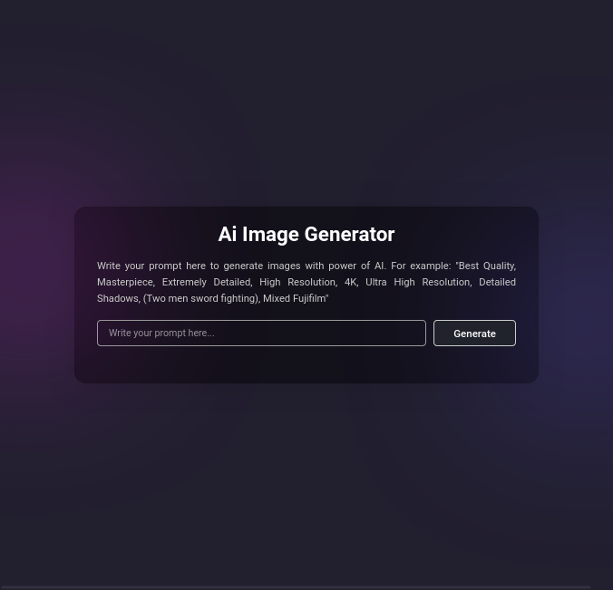
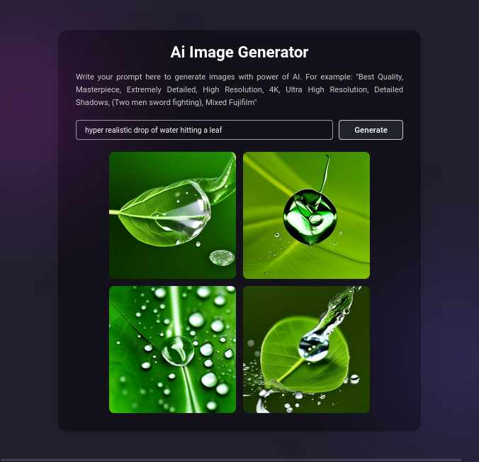

> Web app that generates image using AI

I have utilized a model called openjourney made by prompthero

**A Hugginface API key is required which you can get quite easily** 

`const apiKey = "api key goes here"`

You can use any image generation model available on hugginface.co. If you decide to do so, then change the model-link with the link of the model you are using in script.js

`"https://api-inference.huggingface.co/models/model-link"`

# Screenshots

### At initial loading of site

### After generating images
